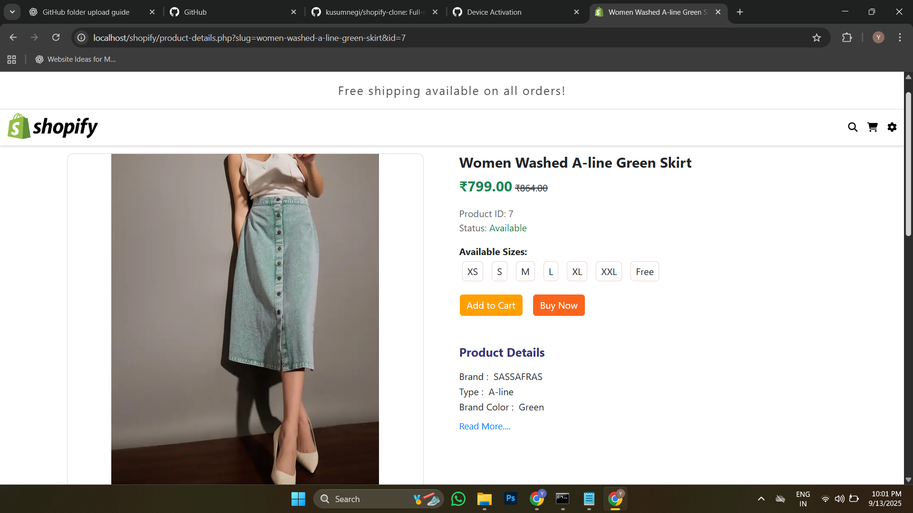
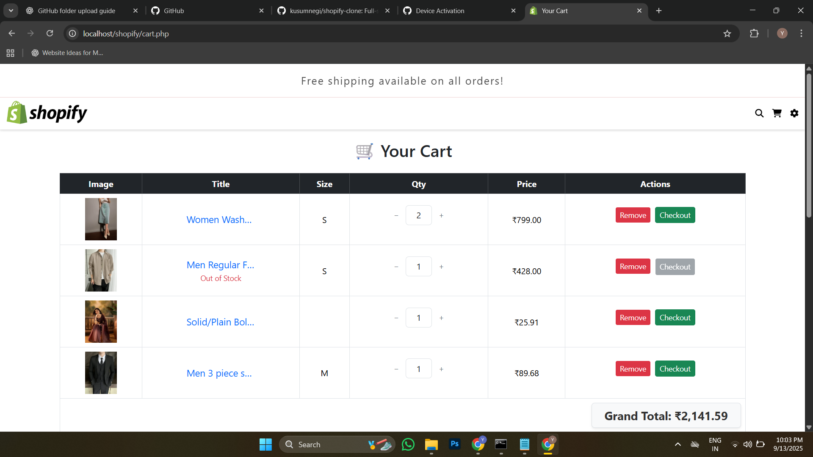
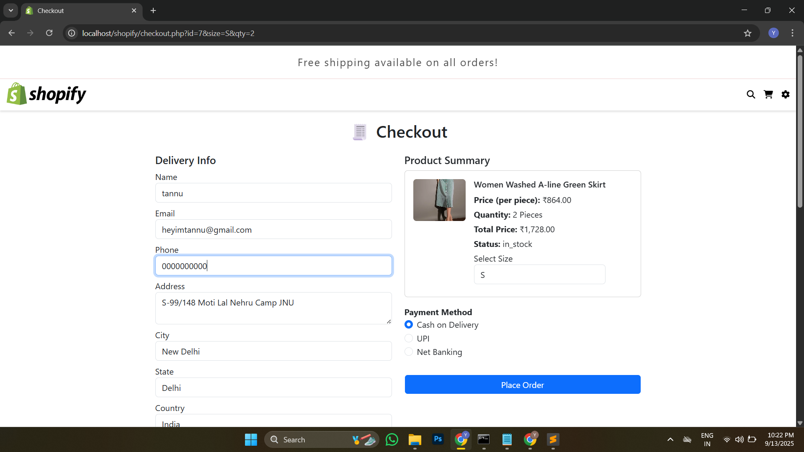
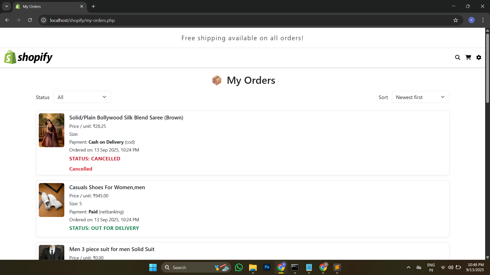
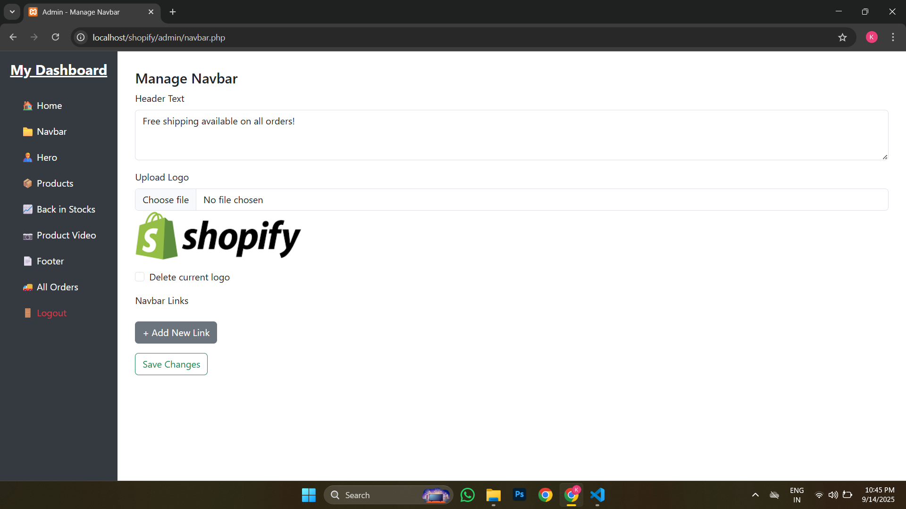
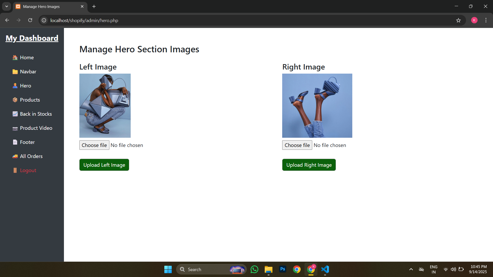
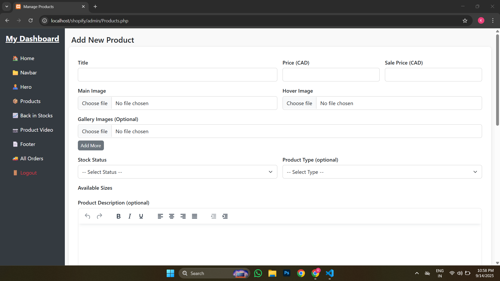
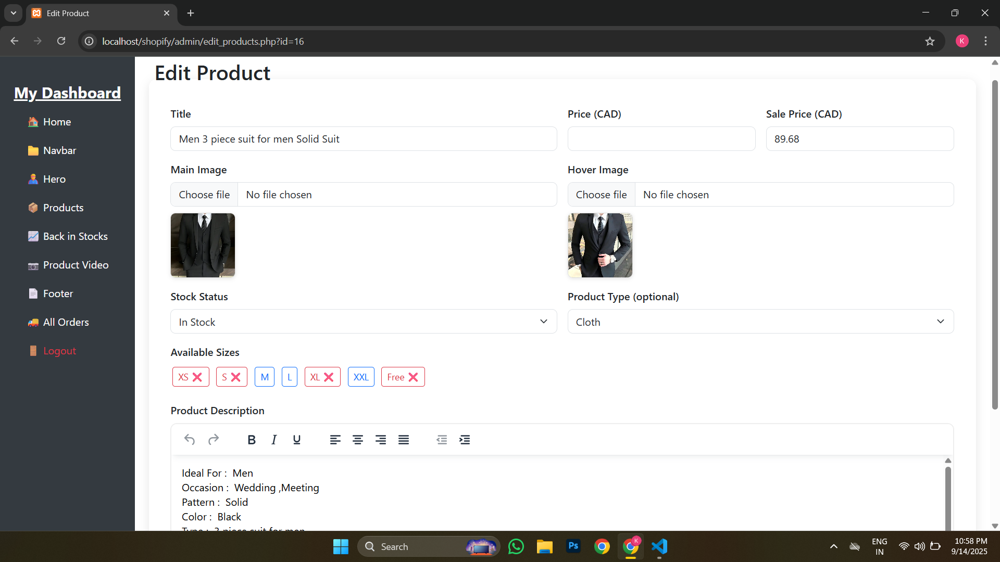
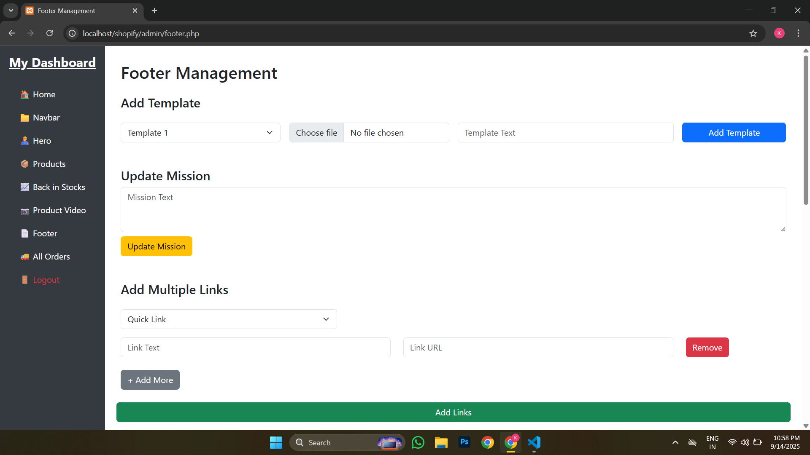

# shopify-clone

Full-stack Shopify clone using HTML, CSS, JavaScript, PHP, MySQL & Bootstrap. Fully dynamic website with admin panel for product & category management, interactive UI, responsive design, and smooth user experience. Portfolio-ready real-world e-commerce project.

___
## Screenshots

### 1. Hero Section

### 2. Product Details

### 3. Cart Page

### 4. Checkout Page

### 5. Order History

### 6. Manage Navbar

### 7. Manage Hero Images

### 8. Add Products

### 9. Edit Products

### 10. Manage Footer

